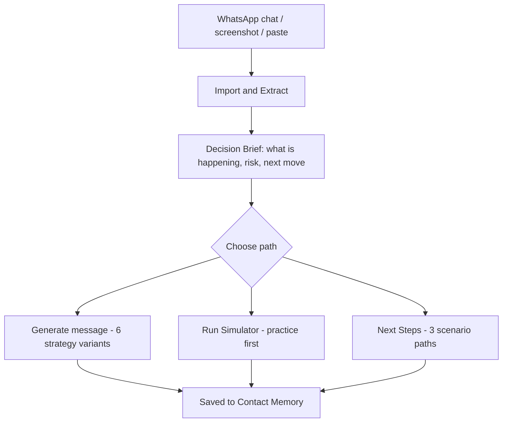
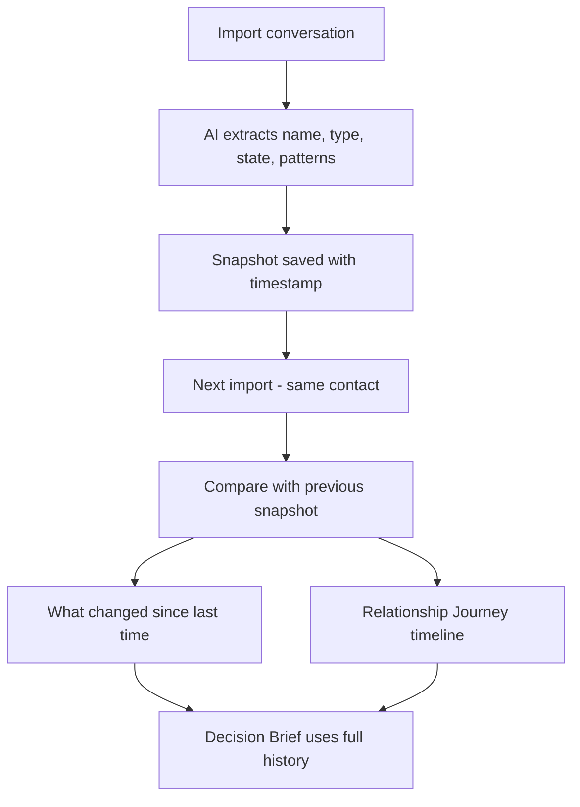
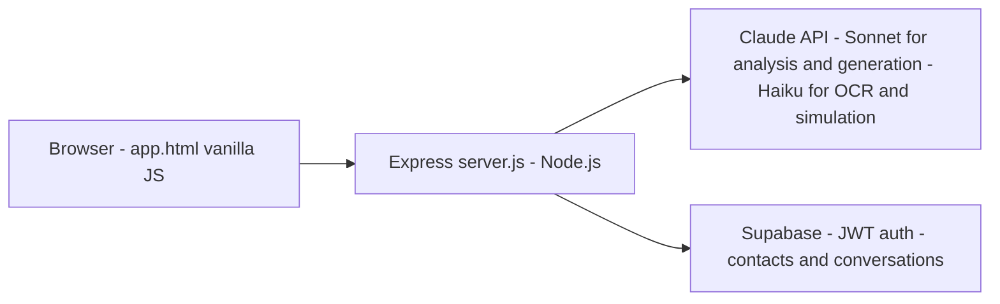

# AIWILLMAKE

An AI conversation navigator — it helps you decide what to say, understand what they meant, and practice before you send.

Not a chatbot. Not a generic text generator. It keeps a memory of your relationships and gives you a decision layer on top of each conversation.

---

## What it does



### Conversation Analysis & Decision Brief
Paste their reply (or import a WhatsApp chat via screenshot, .txt export, or paste) and get a structured read: what the message signals, the risk in the dynamic, what to do next, and what to avoid. Decision Brief is the core output — not just tone labels, but actionable framing.

### Contact Memory
Each person you talk to gets a persistent profile: relationship type, emotional state, observed patterns, and a conversation timeline. After each conversation the system updates what it knows ("what changed since last time"). The profile follows you across sessions — you don't re-explain context every time.

### Conversation Simulator
Before you send something real, you can run a practice conversation. The AI plays the other person using their stored profile (communication style, patterns, how they typically respond). After the session you get a short debrief — a coach's read on how the approach landed in the rehearsal.

### Message Generation
6 strategy-tagged message variants per request. Each card shows the message plus: why this approach works, what barrier it addresses, the emotional pressure it applies, best context to use it in, and what could go wrong. Strategy selector (Vulnerable & honest, Direct & confident, Strategic, etc.) lets you steer the output.

### Reply Intelligence
- **Next Reply options** — 3 strategy-tagged responses after their message
- **Likely Responses** — what they might say back to your planned message, and how to handle each
- **Next Steps** — 3 scenario-based forward moves (positive / neutral / difficult)
- **Message Review** — pre-send tone and risk check

### Scope
9 top-level categories, ~80 subcategories: Personal (partner, ex, family, apology…), Social Media, Email, Business, Academic, Official, Medical, Listings, Creative. 7 interface languages.

---

## How it differs from ChatGPT

ChatGPT has no memory of the person you're writing to. You explain context every time, get a message, and that's it. AIWILLMAKE builds a persistent model of the other person — patterns, history, relationship state — and uses it across every interaction with them. The Simulator adds rehearsal. The Decision Brief adds framing. The difference is continuity and decision support, not generation quality.



---

## Technical

**Stack**
- Backend: Node.js + Express 5
- AI: Anthropic Claude API — `claude-sonnet-4-6` for analysis/simulation, `claude-haiku-4-5` for lighter tasks
- Auth + Storage: Supabase (JWT auth, PostgreSQL via REST API)
- Frontend: single-file (`app.html`), no build step, no framework



**Key implementation details**
- **Multimodal input**: Screenshot OCR uses Claude's vision API (base64 image → conversation transcript). Accepts JPEG/PNG/WebP/GIF up to 10MB.
- **Contact extraction**: WhatsApp export or free-text description → AI extracts name, type, relationship state, and up to 5 behavioral patterns.
- **Conversation persistence**: Auth-required endpoints store full conversation history in Supabase with outcome tracking per message.
- **Rate limiting**: 10 requests/minute per IP (express-rate-limit).
- **Auth model**: `optionalAuth` for generation (works without account, credits tracked), `requireAuth` for contacts/conversations. If Supabase env is absent the server returns 503 rather than bypassing auth.
- **Credit system**: 5 free generations per account, tracked in `user_credits` table via SELECT + INSERT/PATCH pattern.
- **Context gating**: Categories that require a named contact (most personal categories) gate the generate button until a contact context is set.

**API surface**
```
GET  /api/categories              — category + field schema
GET  /api/credits                 — current usage for authenticated user
POST /api/generate                — 6 strategy-tagged message variants
POST /api/detect-category         — AI categorisation of free-text input
POST /api/analyze-reply           — Decision Brief for an incoming message
POST /api/next-reply              — 3 strategy-tagged reply options
POST /api/likely-responses        — what they might say back
POST /api/next-steps              — 3 forward-move scenarios
POST /api/review-message          — pre-send tone/risk check
POST /api/extract-screenshot      — OCR a chat screenshot (multimodal)
POST /api/analyze-conversation    — full conversation analysis + pattern extraction
POST /api/simulate-reply          — AI plays the other person (simulator turn)
POST /api/simulate-debrief        — post-practice coaching debrief

# Auth-required (Supabase JWT)
GET/POST/DELETE /api/conversations
POST            /api/conversations/:id/messages
PATCH           /api/conversations/:id/messages/:msgId/outcome
GET/POST/PATCH/DELETE /api/contacts
POST            /api/contacts/from-text
```

---

## Setup

**Requirements:** Node.js 18+, Anthropic API key, Supabase project (optional — app works without it but contacts/conversations won't persist and auth is disabled)

```bash
npm install
```

Create `.env`:

```
ANTHROPIC_API_KEY=sk-ant-...
SUPABASE_URL=https://your-project.supabase.co
SUPABASE_ANON_KEY=eyJ...
PORT=3000
```

```bash
node server.js
# → open http://localhost:3000
```

**Without Supabase**: omit `SUPABASE_URL` / `SUPABASE_ANON_KEY`. All AI features work. Contacts, conversations, and auth-required endpoints return 503.

**Database**: Requires `contacts`, `conversations`, `conversation_messages`, and `user_credits` tables in Supabase. Row-level security should be enabled with `user_id = auth.uid()` policies.

---

## Status

Pre-launch. Core features (generation, reply analysis, contact memory, simulator) are working. Free tier limited to 5 generations; upgrade gate in place. TEST BYPASS active for dev email — remove before production.
